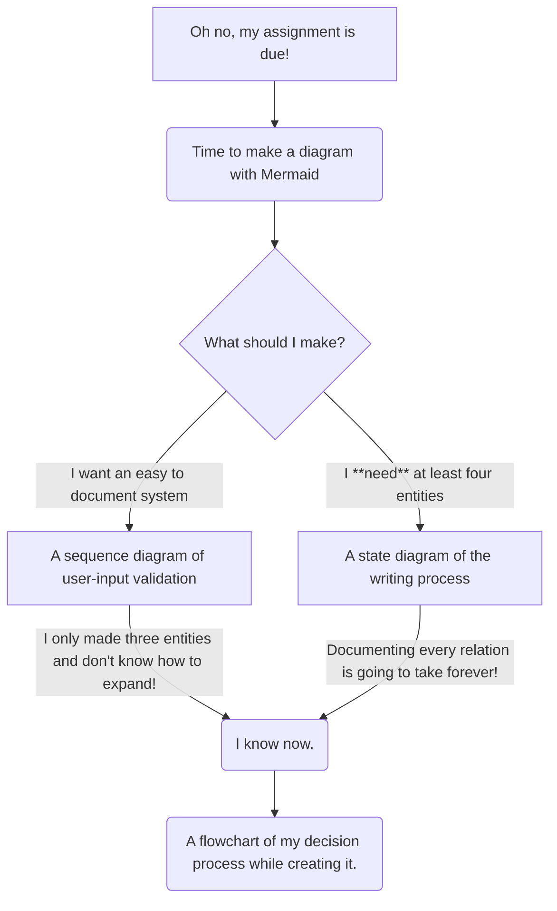
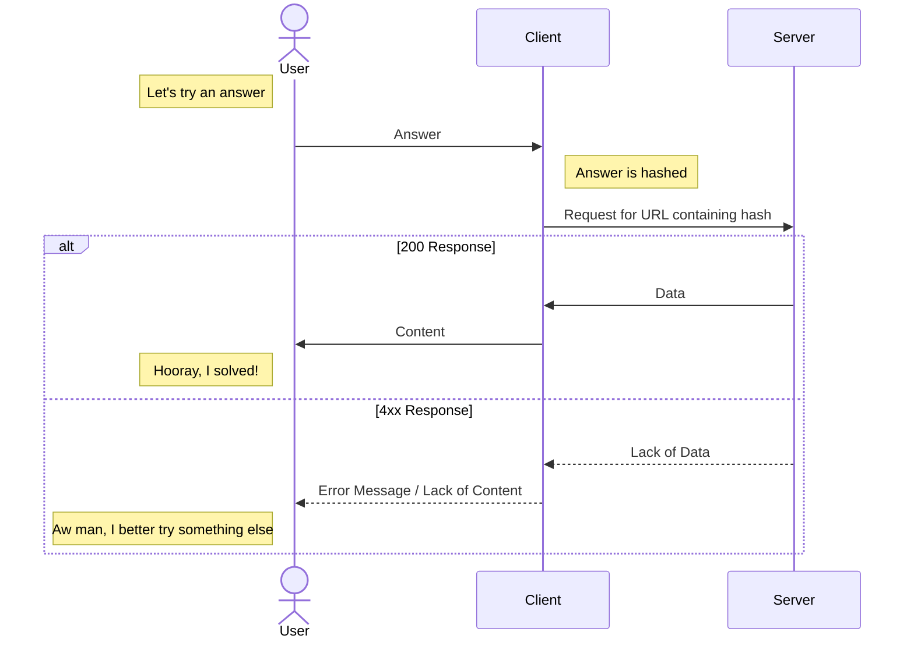

# Entities
## __Oh no, my assignment is due!__
This represents 11 A.M. September 29th, when I realized I had an assignment due.
## __Time to make a diagram with Mermaid__
I had skimmed the Mermaid Documentation earlier, but only actual read it on the day it was due.
## __What should I make?__
I checked the diagram types and tried to come up with modelable scenarios.
## A sequence diagram of user-input validation
This was something that I had a lot of experience with, both using and developing.

###### The completed diagram
## A state diagram of the writing process
I thought it would be a nice thing to model, but realized the complexity was much greater than my current skill.
## I know now.
With both of my current options seemingly nonviable, I came up with another.
## A flowchart of my decision process while creating it.
This is said flowchart.

# Relations
The labels on either side show the reasoning behind each decision.
This diagram isn't __entirely__ accurate, as the attempt at a state diagram was directly influenced by the sequence diagram. However, the thought process could have essentially gone the other way, as was thus bifurcated.
